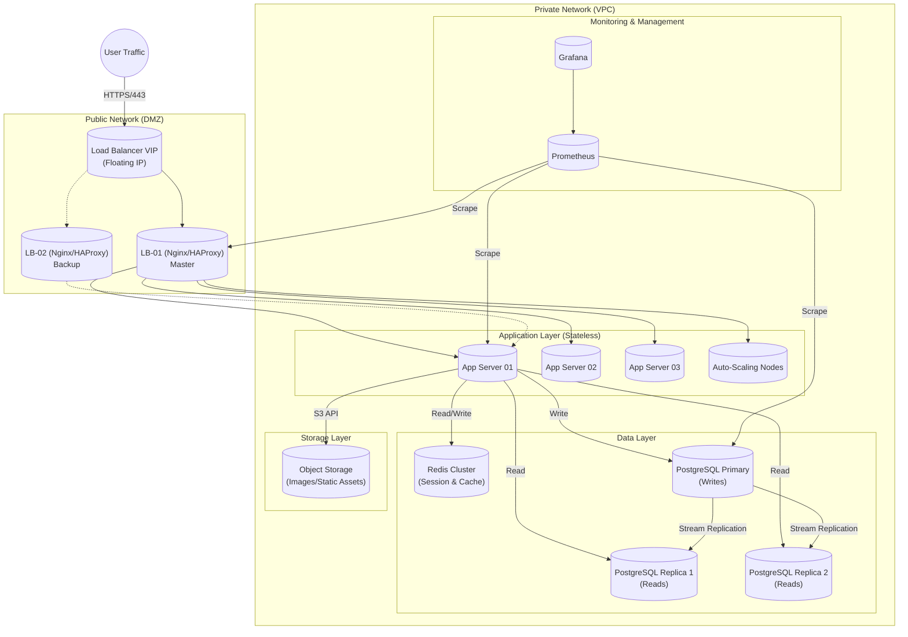

# QuickCart - Dokumen Desain Arsitektur Infrastruktur

## 1. Diagram Arsitektur

Diagram berikut mengilustrasikan infrastruktur **High-Availability** yang dirancang untuk menangani 5.000 **Concurrent Users** dan 50GB data gambar, di-deploy pada penyedia **VPS** (misalnya, DigitalOcean/Linode).

---

## 2. Spesifikasi Server & Perencanaan Kapasitas

Didasarkan pada kebutuhan **5.000 Concurrent Users** dan *peak request rate* sekitar **~5.000 req/sec** (gabungan dari browsing, auth, cart, checkout), dengan lonjakan **10x Flash Sale**.

### 2.1. Perhitungan & Alasan

*   **Traffic Baseline**: 5.000 *active users* * ~1 req/sec (rata-rata) = 5.000 req/sec.
*   **Asumsi Performa Aplikasi**: Aplikasi web standar (Node.js/Go) pada vCPU modern dapat menangani ~100-200 req/sec/core (untuk request non-trivial).
    *   Target: 5.000 req/sec.
    *   Cores Dibutuhkan: $5000 / 150 \approx 34 \text{ Cores}$.
*   **Strategi Flash Sale**: 50.000 req/sec terlalu tinggi untuk *static provision*. Kita akan menggunakan **VM Scale Sets** atau **API-driven Auto-Scaling** untuk *spin up* droplet tambahan selama *scheduled events*.

### 2.2. Spesifikasi Komponen

| Komponen | Role | Spec (vCPU / RAM) | Storage | Quantity | Scaling Trigger |
| :--- | :--- | :--- | :--- | :--- | :--- |
| **Load Balancer** | Traffic Distribution, SSL Termination | 2 vCPU / 4 GB | 50 GB SSD | 2 (HA) | CPU > 60% (Network Limit) |
| **App Server** | Core Logic (Stateless) | 4 vCPU / 8 GB | 50 GB SSD | 8 - 10 | CPU > 70% atau RAM > 80% |
| **DB Primary** | Write Operations | 8 vCPU / 32 GB | 500 GB NVMe | 1 | Disk IOPS / CPU > 70% |
| **DB Replica** | Read Operations | 4 vCPU / 16 GB | 500 GB NVMe | 2 | Read Latency > 100ms |
| **Redis** | Caching, Session Store | 4 vCPU / 16 GB | 100 GB SSD | 1 Cluster | Memory usage > 70% |
| **Object Storage** | Product Images (50GB+) | - | Unlimited | Bucket | Bandwidth |

---

## 3. Strategi Database

### 3.1. Sizing & Konfigurasi
*   **Teknologi**: PostgreSQL 14+.
*   **Storage**: 500GB NVMe untuk menampung 100k produk, 500k user, dan 10k order/hari dengan ruang pertumbuhan yang cukup (indexes + logs). Gambar produk di-**OFFLOAD** ke **Object Storage** (S3-compatible) agar DB tetap ringan.
*   **Tuning Konfigurasi**:
    *   `shared_buffers`: 25% dari RAM.
    *   `effective_cache_size`: 75% dari RAM.
    *   `max_connections`: Di-tuning dengan **PgBouncer** (Connection Pooling) untuk menangani *high concurrency*.

### 3.2. Strategi Read Replica
*   **Rasio**: 1 Primary : 2 Replicas.
*   **Logika**: Menggunakan *connection strings* terpisah untuk Write (Primary) dan Read (Replica) di level aplikasi.
*   **Async Replication**: Menggunakan standar *streaming replication* untuk meminimalkan *write latency* pada Primary.

### 3.3. Backup & Recovery
*   **RPO (Recovery Point Objective) < 5 min**:
    *   Mengaktifkan **WAL Archiving** (*Continuous Archiving*) ke S3 setiap 60 detik.
*   **RTO (Recovery Time Objective) < 15 min**:
    *   **Daily Full Backup** (`pg_dump` / `basebackup`) pada pukul 02:00 AM.
    *   Script restore otomatis untuk menguji backup setiap minggu.

---

## 4. High Availability & Disaster Recovery

### 4.1. Kegagalan Server
*   **Level Load Balancer**: Menggunakan **Keepalived + VRRP** (*Virtual Router Redundancy Protocol*). Jika Master LB mati, **Floating IP** otomatis pindah ke Backup LB dalam < 3 detik.
*   **Level App**: Desain **Stateless**. Jika App Server 01 mati, Load Balancer mendeteksi status "Unhealthy" via **Health Check** (`/healthz`) dan menghapusnya dari pool.

### 4.2. Failover Database
*   **Strategi**: Menggunakan **Patroni** atau **Repmgr** untuk *automated failover*.
*   **Proses**:
    1.  Primary mengirimkan *heartbeat*.
    2.  Jika Primary berhenti merespons, *Consensus store* (misal: etcd/Consul) memilih Replica paling *up-to-date* sebagai Primary baru.
    3.  App servers otomatis dialihkan via **PgBouncer** atau **Service Discovery**.

---

## 5. Pertimbangan Keamanan

### 5.1. Keamanan Jaringan
*   **VPC (Virtual Private Cloud)**:
    *   **Public Subnet**: Hanya Load Balancers dan Bastion Host (VPN).
    *   **Private Subnet**: App Servers, Databases, Redis. TIDAK ADA akses internet langsung.
*   **Firewall (UFW / Cloud Firewall)**:
    *   LB: Allow 80/443 dari Any.
    *   App: Allow 3000-8000 hanya dari LB Private IP.
    *   DB: Allow 5432 hanya dari App Private IP.
    *   SSH: Allow 22 hanya dari Bastion/VPN IP.

### 5.2. Manajemen Secrets
*   **No Hardcoded Secrets**: Credentials (DB Password, API Keys) **tidak boleh** di-commit ke Git.
*   **Implementasi**:
    *   **Development**: File `.env` (gitignored).
    *   **Production**: Inject secrets sebagai **Environment Variables** saat CI/CD deployment atau gunakan **Secret Manager** (misal: HashiCorp Vault / Cloud Secret Manager, atau Docker Secrets).

---

## 6. Penanganan Flash Sale (Kasus Khusus)

Untuk menangani **10x Traffic (50.000 req/sec)**:
1.  **Pre-warming**: *Scale out* App Servers dari 8 ke 50 node 1 jam sebelum event.
2.  **CDN Caching**: Serve semua *static assets* (JS, CSS, Images) via **CDN** (Cloudflare/Cloudfront) untuk meng-*offload* hits.
3.  **Queueing**: Implementasikan "Waiting Room" atau **Rate Limiting** (misal: Leaky Bucket) jika traffic melebihi kapasitas maksimal untuk mencegah DB *collapse*.
