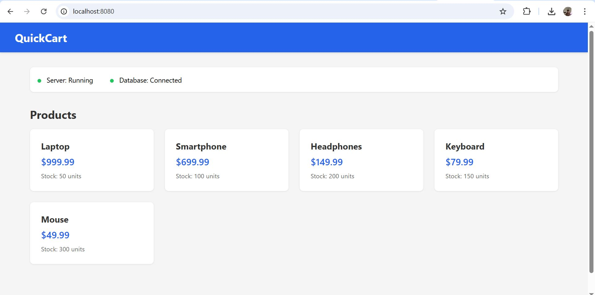
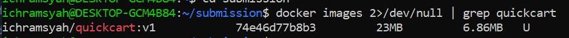
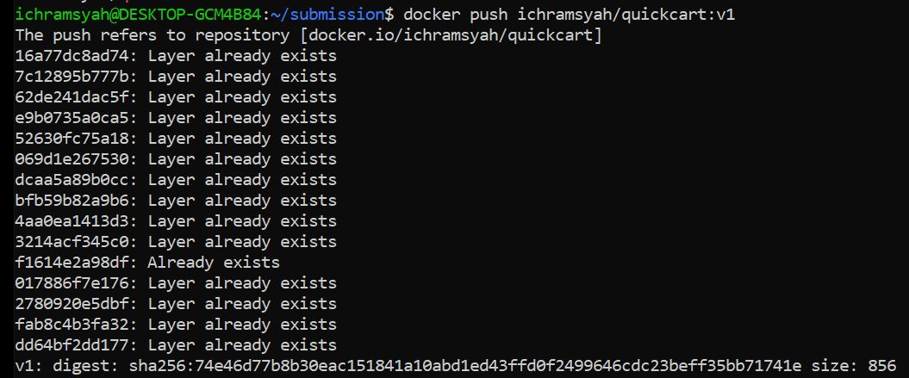
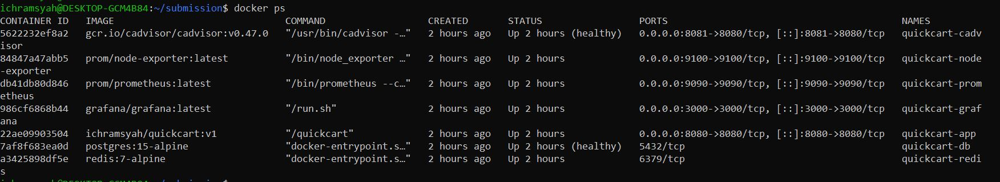

# Containerisasi dan Deployment Aplikasi (QuickCart)

## 1. Gambaran Proyek

Proyek ini mendemonstrasikan proses **containerization** aplikasi **QuickCart** menggunakan **Docker** dan **Docker Compose**.
Tujuannya adalah menghasilkan deployment yang **aman**, **ringan**, dan **siap produksi**.

## 2. Prasyarat

Pastikan perangkat sudah memiliki:

- Docker & Docker Compose
- Git
- Akun dan akses ke **Docker Hub**

## 3. Langkah Implementasi

### Langkah 1: Clone Repository

Pertama, saya melakukan clone source code dari repository.

```bash
git clone https://repository.teamdev.id/interview/quickcart.git
cd quickcart
```

### Langkah 2: Strategi Containerisasi (Dockerfile)

Saya menerapkan strategi **Multi-stage Build** untuk memastikan image yang dihasilkan ringan dan aman.

- **Tahap Builder:** Menggunakan `golang:1.22-alpine` untuk mengkompilasi aplikasi.
- **Tahap Akhir:** Menggunakan `gcr.io/distroless/static-debian12:nonroot`

#### Mengapa Distroless?

- **Optimasi Ukuran:** Mengurangi ukuran image secara signifikan (sekitar 23MB).
- **Keamanan:** Tidak mengandung shell atau package manager, mengurangi permukaan serangan (attack surface).
- **Non-root:** Berjalan sebagai pengguna non-privileged (bukan root) secara default.

```bash
# --- Stage 1: Builder ---
FROM golang:1.22-alpine AS builder

RUN apk add --no-cache git

WORKDIR /app

# Optimization: Cache Layering
COPY go.mod go.sum ./
RUN go mod download

# Copy source code
COPY . .

# Build Binary
RUN CGO_ENABLED=0 GOOS=linux go build -o quickcart main.go

# --- Stage 2: Production ---

# Distroless Static
FROM gcr.io/distroless/static-debian12:nonroot

WORKDIR /

# Copy binary hasil build dari stage builder
COPY --from=builder /app/quickcart /quickcart

# Copy .env sample
COPY --from=builder /app/.env.example .env

# Default Go 8080
EXPOSE 8080

# Security Best Practice
USER nonroot:nonroot

ENTRYPOINT ["/quickcart"]
```

### Langkah 3: Build & Verifikasi

Perintah yang digunakan untuk membangun image:

```bash
docker build -t ichramsyah/quickcart:v1 .
```

#### Hasil Verifikasi:

Ukuran image akhir adalah **23MB**, yang sangat teroptimasi dibandingkan dengan base image standar.



### Langkah 4: Push ke Registry

Image tersebut didorong (push) ke Docker Hub untuk mensimulasikan artifak siap produksi.

```bash
docker login
docker push ichramsyah/quickcart:v1
```



### Langkah 5: Deployment via Docker Compose

Saya membuat file `docker-compose.yml` untuk mengorkestrasi aplikasi beserta dependensinya:

1. **App:** QuickCart (ditarik dari `ichramsyah/quickcart:v1`).
2. **Database:** Postgres 15 Alpine.
3. **Cache:** Redis 7 Alpine.

Perintah untuk deploy:

```bash
docker-compose up -d
```

### Langkah 6: Verifikasi Akhir

Semua service berjalan dengan benar.



## 4. Masalah yang Dihadapi & Penyelesaian

Selama proses, saya menghadapi beberapa tantangan dan menyelesaikannya sebagai berikut:

#### Masalah 1: Ukuran Image Besar

- **Masalah:** Build awal menggunakan single-stage build berbasis `golang:1.22` menghasilkan image berukuran >800MB karena menyertakan full Go toolchain dan dependency OS.
- **Penyelesaian:** Menerapkan **Multi-stage Build** dan mengganti base image akhir ke **Distroless** (`gcr.io/distroless/static`). Ini mengurangi ukuran hingga ~23MB.

#### Masalah 2: Koneksi Aplikasi ke Database (Race Condition)

- **Masalah:** Container aplikasi melakukan koneksi ke database saat startup, namun service Postgres belum sepenuhnya siap menerima koneksi meskipun containernya sudah berjalan, sehingga terjadi error `connection refused`.
- **Penyelesaian:** Menerapkan `healthcheck` pada service Postgres dan menambahkan kondisi `depends_on` dengan `service_healthy` di `docker-compose.yml`. Ini memastikan Aplikasi menunggu sampai DB benar-benar siap untuk menerima koneksi.

#### Masalah 3: Masalah Keamanan

- **Masalah:** Menjalankan aplikasi sebagai `root` di dalam container adalah risiko keamanan.
- **Penyelesaian:** Mengonfigurasi Dockerfile untuk menggunakan `USER nonroot:nonroot` (tersedia di Distroless) untuk menegakkan prinsip least privilege.

## 5. Kesimpulan

Aplikasi kini telah sepenuhnya ter-containerisasi, dioptimalkan untuk produksi, dan berhasil di-deploy menggunakan Docker Compose.
