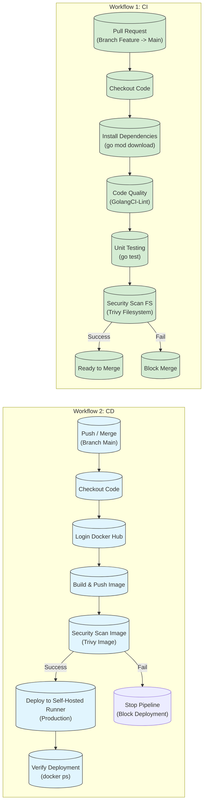

# QuickCart - Desain Pipeline CI/CD

Dokumen ini menjelaskan implementasi _Continuous Integration_ dan _Continuous Deployment_ (CI/CD) untuk aplikasi QuickCart menggunakan **GitHub Actions**.

## 3.1 Pipeline Design Document

### Diagram Alur Pipeline

Berikut adalah visualisasi tahapan pipeline yang telah diimplementasikan dalam dua workflow terpisah.

### Penjelasan Tahapan Pipeline

Pipeline dibagi menjadi dua _workflow_ utama untuk memisahkan proses validasi dan deployment.

#### A. Workflow 1: CI - Quality Gate (`ci-checks.yml`)

Workflow ini berjalan otomatis saat ada **Pull Request** ke branch `main`. Tujuannya untuk memastikan kode yang akan masuk ke production aman dan berkualitas.

1.  **Checkout & Dependencies**: Mengambil source code & mendownload library Go.
2.  **Linting (GolangCI-Lint)**: Memeriksa standar penulisan kode (Static Analysis).
3.  **Unit Testing**: Menjalankan tes fungsional aplikasi (`go test`).
4.  **Security Scan (Filesystem)**: Memindai kode sumber menggunakan **Trivy** untuk mencari celah keamanan (_vulnerabilities_) sebelum kode di-build.

#### B. Workflow 2: CD - Build & Deploy (`deploy.yml`)

Workflow ini berjalan otomatis setelah kode berhasil di-**Merge** atau di-**Push** ke branch `main`. Tujuannya untuk mengupdate aplikasi di server production.

1.  **Build & Push**: Membuat image Docker dari source code terbaru dan menguploadnya ke **Docker Hub** dengan tag `latest`.
2.  **Scan Docker Image**: Memindai image yang sudah jadi menggunakan **Trivy** untuk memastikan base image aman dari celah keamanan Kritis (_CRITICAL severity_).
3.  **Deploy to Production**:
    - Menggunakan **Self-Hosted Runner** (Github Runner yang diinstall langsung di server VPS).
    - Melakukan `docker pull` image terbaru.
    - Merestart container aplikasi (`docker-compose up -d --no-deps app`) tanpa mengganggu database.
    - Membersihkan image lama (`docker image prune`) untuk menghemat disk.

---

### Strategi Branching & Deployment

Kami menggunakan strategi **Trunk-Based Development** yang disederhanakan:

| Branch           | Environment    | Trigger Pipeline | Deskripsi                                                                                     |
| :--------------- | :------------- | :--------------- | :-------------------------------------------------------------------------------------------- |
| `feature/*`      | -              | Manual / Local   | Branch pengembangan fitur oleh developer.                                                     |
| **Pull Request** | **CI Check**   | Otomatis         | Wajib lulus _Quality Gate_ (Lint, Test, SecScan) sebelum bisa di-merge.                       |
| `main`           | **Production** | Otomatis         | Branch utama yang selalu siap rilis. Setiap commit di sini akan langsung di-deploy ke server. |

---

### Strategi Rollback

Jika terjadi error kritis pasca-deployment di Production, strategi rollback berikut diterapkan:

1.  **Revert Commit (Git)**:
    - Developer melakukan `git revert` pada commit yang bermasalah.
    - Push revert commit tersebut ke `main`.
    - Pipeline CD otomatis berjalan lagi untuk men-deploy versi sebelumnya (karena versi sebelumnya sekarang menjadi HEAD baru).

2.  **Manual Rollback (Emergency)**:
    - Masuk ke server via SSH.
    - Edit `docker-compose.yml` untuk menggunakan tag image versi stabil sebelumnya (jika menggunakan versioning tag).
    - Jalankan `docker-compose up -d`.

---

## 3.2 Implementasi Pipeline

Implementasi lengkap dapat dilihat pada file konfigurasi berikut:

- **CI Checks**: `part3-cicd/project_folder/ci-checks.yml`
- **Deployment**: `part3-cicd/project_folder/deploy.yml`
