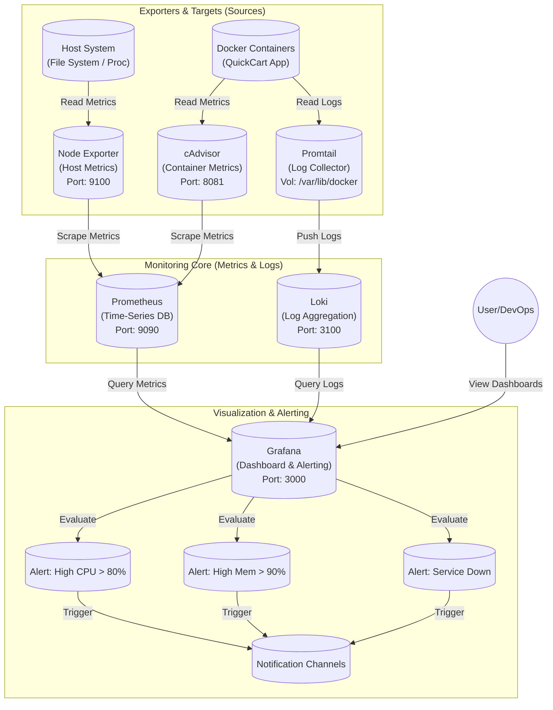
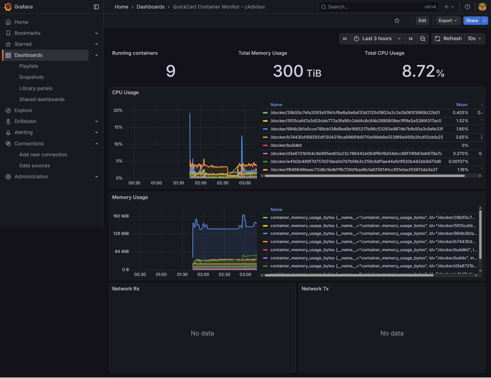
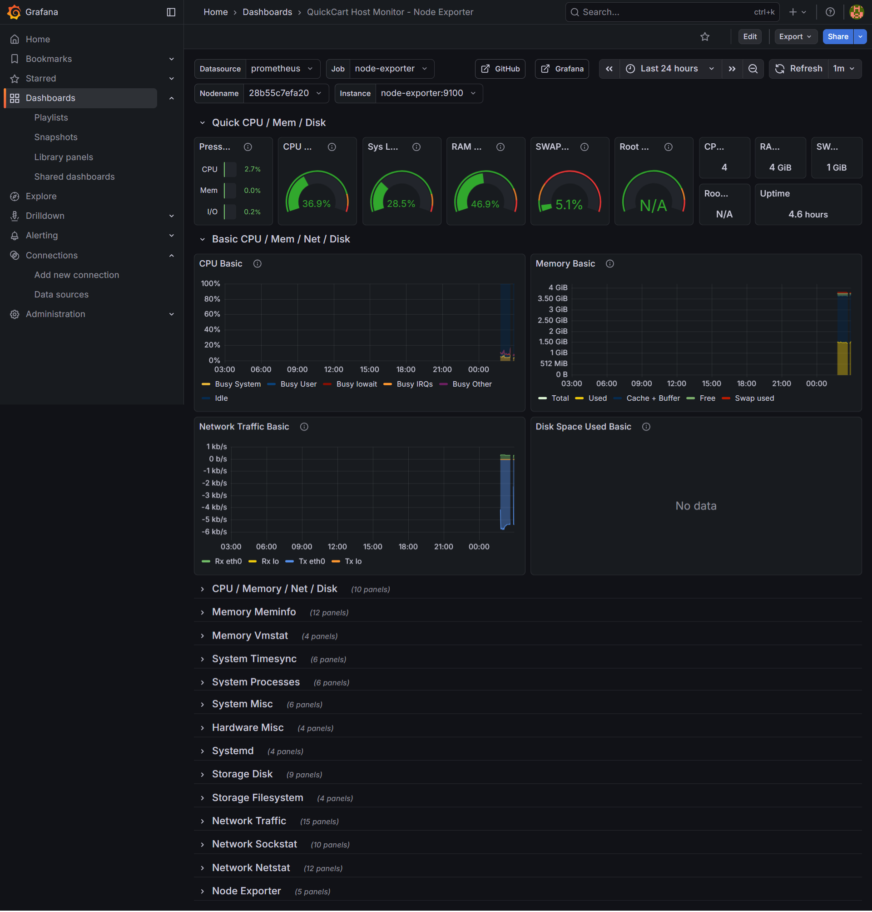
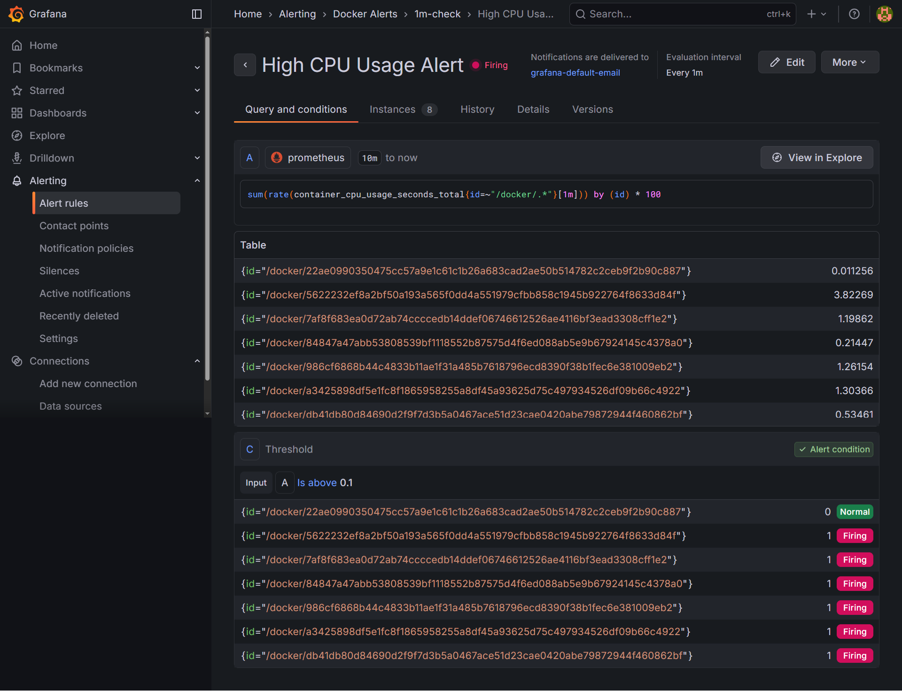
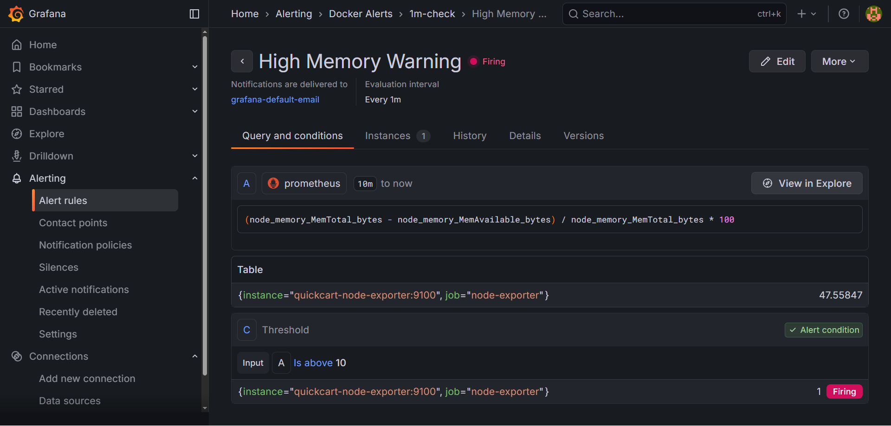
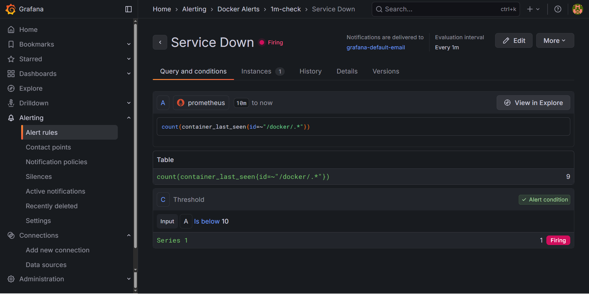
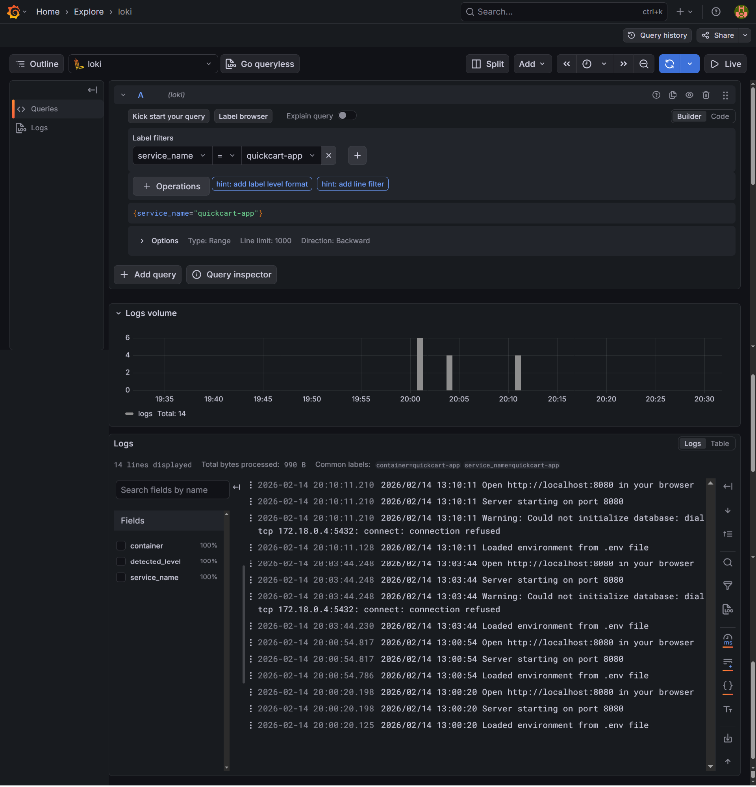

# Desain Monitoring & Alerting - QuickCart

Dokumen ini menjelaskan arsitektur monitoring, strategi pemilihan dashboard, dan skenario alerting yang diimplementasikan untuk menjamin ketersediaan aplikasi QuickCart.

## 1. Arsitektur Monitoring

Sistem monitoring dibangun menggunakan stack berikut untuk menjamin visibilitas penuh terhadap infrastruktur dan aplikasi.

### Diagram Arsitektur & Alur Data

### Detail Komponen & Port

Berikut adalah rincian layanan yang dijalankan dalam `docker-compose.yml`:

| Komponen          | Container Name            | Image                              | Port (Host:Internal) | Deskripsi                                                                               |
| :---------------- | :------------------------ | :--------------------------------- | :------------------- | :-------------------------------------------------------------------------------------- |
| **Prometheus**    | `quickcart-prometheus`    | `prom/prometheus:latest`           | **9090:9090**        | Server utama yang mengumpulkan (pull) metrik dari semua target setiap 15 detik.         |
| **Grafana**       | `quickcart-grafana`       | `grafana/grafana:latest`           | **3000:3000**        | Antarmuka visual untuk membuat dashboard, alerting, dan melihat data (Metrics & Logs).  |
| **Loki**          | `quickcart-loki`          | `grafana/loki:latest`              | **3100:3100**        | Database log yang efisien untuk menyimpan da mengindeks log yang dikirim oleh Promtail. |
| **Promtail**      | `quickcart-promtail`      | `grafana/promtail:latest`          | **-**                | Agent yang membaca log container dan mengirimkannya ke Loki.                            |
| **cAdvisor**      | `quickcart-cadvisor`      | `gcr.io/cadvisor/cadvisor:v0.47.0` | **8081:8080**        | Memonitor penggunaan resource (CPU, Memory, Network) dari setiap **kontainer Docker**.  |
| **Node Exporter** | `quickcart-node-exporter` | `prom/node-exporter:latest`        | **9100:9100**        | Memonitor metrik level **hardware/OS host** (Disk usage, RAM, CPU Load).                |

---

## 2. Desain Dashboard & Rasionalisasi (What & Why)

Berikut adalah rincian dashboard yang dibuat beserta alasannya:

### A. Dashboard Monitoring Kontainer (Aplikasi)

**Apa yang dimonitor:**
Dashboard ini memvisualisasikan data dari **cAdvisor**, berfokus pada penggunaan CPU, Memori, dan Network I/O spesifik untuk kontainer `quickcart-app`.

**Mengapa ini dibutuhkan?**

1.  **Isolasi Masalah Aplikasi:** Kita perlu membedakan apakah lonjakan beban disebabkan oleh aplikasi QuickCart atau proses sistem lain.
2.  **Deteksi Memory Leak:** Memantau penggunaan RAM kontainer secara spesifik membantu mendeteksi kebocoran memori (memory leak) pada kode aplikasi sebelum kontainer dimatikan oleh OOM Killer (Out of Memory).
3.  **Resource Limiting:** Memastikan aplikasi berjalan dalam batas resource (limit) yang ditentukan di Docker Compose.

_Gambar 1: Dashboard cAdvisor menampilkan performa kontainer QuickCart._

### B. Dashboard Monitoring Host (Infrastruktur)

**Apa yang dimonitor:**
Dashboard ini memvisualisasikan data dari **Node Exporter**, menampilkan kesehatan server secara keseluruhan (CPU Load, Total RAM, Disk Usage).

**Mengapa ini dibutuhkan?**

1.  **Kesehatan Infrastruktur:** Jika server host mati atau kehabisan sumber daya, semua kontainer di dalamnya akan mati. Ini adalah lapisan pertahanan pertama.
2.  **Capacity Planning:** Memantau tren penggunaan disk dan memori host membantu kita memprediksi kapan perlu melakukan upgrade server (scaling vertical).
3.  **Deteksi Noisy Neighbor:** Melihat apakah ada proses di luar Docker yang memakan resource server secara berlebihan.

_Gambar 2: Dashboard Node Exporter menampilkan metrik sistem host._

---

## 3. Strategi Alerting & Bukti Pengujian

Sistem monitoring ini dilengkapi dengan aturan alerting (Alerting Rules) yang dikonfigurasi di Grafana untuk mendeteksi insiden secara proaktif.

Berikut adalah rincian konfigurasi alert yang diterapkan:

### A. Skenario 1: High CPU Usage

Alert ini mendeteksi beban kerja yang tidak wajar pada kontainer aplikasi.

- **Alert Name:** `High CPU Usage Alert`
- **Condition / Threshold:** Is above **80** (Penggunaan CPU > 80%).
- **Severity:** **Critical**
- **Why this alert matters:**
  Penggunaan CPU yang konsisten di atas 80% menandakan aplikasi mengalami _bottleneck_, terjebak dalam proses looping, atau menerima traffic di luar kapasitas. Jika dibiarkan, respons aplikasi akan menjadi sangat lambat (latency tinggi) atau _unresponsive_.

_Gambar 3: Bukti alert CPU terpicu saat beban disimulasikan di atas 0.1%._

---

### B. Skenario 2: High Memory Warning

Alert ini berfungsi sebagai peringatan dini sebelum memori habis.

- **Alert Name:** `High Memory Warning`
- **Condition / Threshold:** Is above **90** (Penggunaan RAM > 90%).
- **Severity:** **Warning**
- **Why this alert matters:**
  Manajemen memori sangat krusial dalam lingkungan kontainer. Jika penggunaan RAM mencapai 100%, sistem operasi (Linux OOM Killer) akan mematikan paksa kontainer `quickcart`, menyebabkan crash mendadak. Alert di angka 90% memberi waktu bagi tim untuk melakukan _scaling_ atau investigasi _memory leak_.

_Gambar 4: Bukti alert Memori terpicu saat penggunaan memori RAM melebihi batas simulasi 10%_

---

### C. Skenario 3: Service Down (Availability)

Alert ini adalah indikator utama ketersediaan layanan.

- **Alert Name:** `Service Down`
- **Condition / Threshold:** Is below **3** (Indikator kesehatan instance tidak valid/mati).
- **Severity:** **Emergency / Page**
- **Why this alert matters:**
  Ini adalah alert dengan prioritas tertinggi. Jika kondisi ini terpenuhi, artinya pengguna tidak bisa mengakses aplikasi QuickCart sama sekali. Downtime berdampak langsung pada pengalaman pengguna dan reputasi bisnis.

_Gambar 5: Bukti alert Service Down terpicu segera setelah layanan QuickCart berhenti._

---

## 4. Implementasi Centralized Logging & Korelasi Data

Untuk meningkatkan kemampuan _troubleshooting_, sistem ini telah dilengkapi dengan **Centralized Logging** menggunakan stack **PLG** (Prometheus, Loki, Grafana). Ini menggantikan metode pengecekan log manual via SSH.

### Arsitektur Logging

- **Promtail:** Agent yang dipasang di host untuk membaca log dari Docker container (`/var/lib/docker/containers`) secara real-time dan mengirimkannya ke Loki.
- **Loki:** Database log yang dioptimalkan untuk menyimpan dan mengindeks log aplikasi.
- **Grafana:** Interface tunggal untuk memvisualisasikan Metrics (dari Prometheus) dan Logs (dari Loki) secara berdampingan.

### Strategi Korelasi (Metrics + Logs)

Dengan integrasi ini, tim DevOps dapat melakukan diagnosa insiden dengan alur berikut:

1.  **Identify (Grafana Dashboard):** Tim melihat lonjakan error rate atau latency pada dashboard metrik.
2.  **Drill Down (Split View):** Menggunakan fitur _Split View_ di Grafana, tim dapat melihat grafik metrik di panel atas dan _query_ log spesifik (`{container="quickcart-app"}`) di panel bawah pada rentang waktu yang sama.
3.  **Root Cause Analysis:** Pesan error spesifik (misal: _NullPointerException_ atau _Connection Timeout_) dapat langsung ditemukan tanpa perlu masuk ke server fisik.

_Gambar 6: Tampilan eksplorasi log aplikasi QuickCart yang terpusat di Grafana._

---

## 4. Kesimpulan

Dengan kombinasi dashboard level kontainer (cAdvisor) dan level host (Node Exporter), serta strategi alerting, tim DevOps memiliki visibilitas penuh (_observability_) terhadap kesehatan aplikasi QuickCart.
